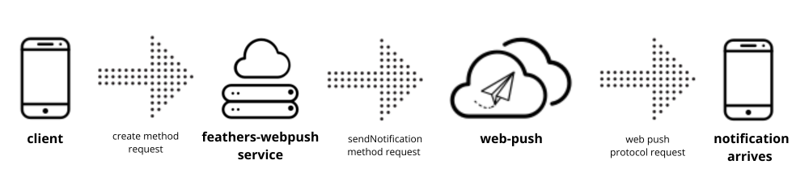

# feathers-webpush

[](https://github.com/kalisio/feathers-webpush/releases)
[](https://app.travis-ci.com/kalisio/feathers-webpush)
[](https://codeclimate.com/github/kalisio/feathers-webpush)
[](https://codeclimate.com/github/kalisio/feathers-webpush/coverage)
[](https://www.npmjs.com/package/@kalisio/feathers-webpush)

> `feathers-webpush` simplifies the sending of web push notifications in a FeathersJS application.

## Principle

The `feathers-webpush` module provides a simplified way to send web push notifications in a FeathersJS application. It leverages the [web-push package](https://github.com/web-push-libs/web-push) to interact with the Web Push protocol.



## Usage

### Installation

```shell
npm install @kalisio/feathers-webpush --save
```

or

```shell
yarn add @kalisio/feathers-webpush
```

### Example

The provided [example](./example/README.md) illustrates how to setup:

* a server app

https://github.com/kalisio/feathers-webpush/blob/49cf6f31acf9cb7b068fa7411a6b2c56f411caea/example/app.mjs#L1-L52

* a browser client app

https://github.com/kalisio/feathers-webpush/blob/49cf6f31acf9cb7b068fa7411a6b2c56f411caea/example/public/index.html#L1-L171

## API

### Service (options)

Create an instance of the service with the given options:

| Parameter | Description | Required |
|---|---|---|
|`vapidDetails` | The vapidDetails configuration. Refer to the [web-push package documentation](https://github.com/web-push-libs/web-push#input-3) for more information. | yes |
| `app` |  The feathers app instance. | yes |

### create (data, params)

The `create` method is used to send web push notifications. The `data` payload must contain the following properties:

| Property | Description | Required |
|---|---|---|
|`dataNotification` | The payload text for the push notification. | yes |
| `subscriptionService` |  The name of the service where subscriptions are registered. | yes |
| `subscriptionCollection` |  The name of the key where subscriptions are regitered. It can be an array of subscriptions or a single subscription object | yes |
| `subscriptionFilter` |  The filter you wish to apply when retrieving subscriptions. | no |

> **Note:** Subscription should be registered in the following format: `{ endpoint: 'url_google', keys: { auth: 'xxxx', p256dh: 'xxxx' }}`

## Client

The `client.js` file provides a utility to manage client-side web push notifications with the following functions:

### checkPrerequisites ()

Checks the prerequisites for using web push notifications:

* Checks if the browser supports service worker.
* Checks if the browser supports the PushManager.
* Checks if the browser supports notifications.
* Checks the notification permissions.

### requestNotificationPermission ()

Requests permission from the user to send notifications. It checks if the permission has not been denied and prompts the user for permission. If permission is denied it throws an error.

### getPushSubscription ()

Retrieves the current push subscription. It returns the push subscription object if available.

### subscribePushNotifications (publicVapidKey)

Subscribes to push notifications using the provided public VAPID key. It obtains the registration from the service worker and subscribes to push notifications with the specified options. It returns the subscription object in following format:
`{ endpoint: 'url_google', keys: { auth: 'xxxx', p256dh: 'xxxx' }}`

### unsubscribePushNotifications ()

Unsubscribes from push notifications. It retrieves the registration from the service worker and unsubscribes the current push subscription. It returns the unsubscribed subscription object.

## Tests

To run the tests for `feathers-webpush`, install the required node modules and run `npm run test` or `yarn test`.

To perform the tests, you need to create web push subscription and set the following environment variables:
* `SUBSCRIPTION_TEST_ENDPOINT`
* `SUBSCRIPTION_TEST_KEY_AUTH`
* `SUBSCRIPTION_TEST_KEY_P256DH`

## License

Copyright (c) 2017-20xx Kalisio

Licensed under the [MIT license](LICENSE).

## Authors

This project is sponsored by 

[](https://kalisio.com)
