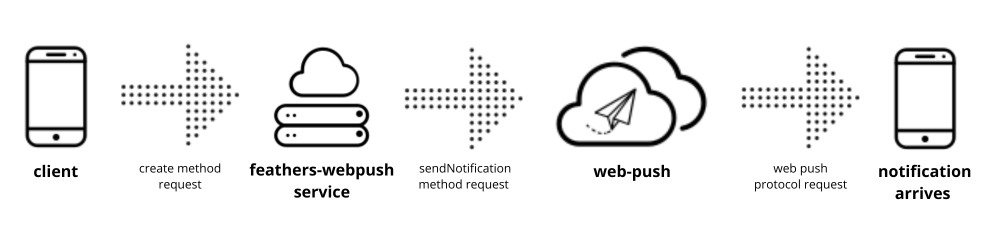

# feathers-webpush

[](https://github.com/kalisio/feathers-webpush/releases)
[](https://github.com/kalisio/feathers-webpush/actions/workflows/main.yaml)
[](https://codeclimate.com/github/kalisio/feathers-webpush)
[](https://codeclimate.com/github/kalisio/feathers-webpush/coverage)
[](https://www.npmjs.com/package/@kalisio/feathers-webpush)

> `feathers-webpush` simplifies the sending of web push notifications in a FeathersJS application.

## Principle

The `feathers-webpush` module provides a simplified way to send web push notifications in a FeathersJS application. It leverages the [web-push package](https://github.com/web-push-libs/web-push) to interact with the Web Push protocol.



## Usage

### Installation

```shell
npm install @kalisio/feathers-webpush --save
```

or

```shell
yarn add @kalisio/feathers-webpush
```

### Example

The provided [example](./example/README.md) illustrates how to setup:

* a server app

https://github.com/kalisio/feathers-webpush/blob/6b09d58428923c95e26cd58d130bc6b268c4cb30/example/server.mjs#L1-L46

* a browser client app

https://github.com/kalisio/feathers-webpush/blob/6b09d58428923c95e26cd58d130bc6b268c4cb30/example/src/index.html#L1-L66

https://github.com/kalisio/feathers-webpush/blob/6b09d58428923c95e26cd58d130bc6b268c4cb30/example/src/index.js#L1-L122

## API

`feathers-webpush` consists of two parts:
* Service that provides create method for sending notifications
* Hooks, which provide function for deleting expired subscriptions

### Service

#### Service (options)

Create an instance of the service with the given options:

| Parameter | Description | Required |
|---|---|---|
|`vapidDetails` | The vapidDetails configuration. Refer to the [web-push package documentation](https://github.com/web-push-libs/web-push#input-3) for more information. | yes |
| `app` |  The feathers app instance. | yes |

#### create (data, params)

The `create` method is used to send web push notifications. The `data` payload must contain the following properties:

| Property | Description | Required |
|---|---|---|
|`notification` | The data payload for the push notification. | yes |
| `subscriptionService` |  The name of the service where subscriptions are registered. | yes |
| `subscriptionProperty` |  The name of the key where subscriptions are regitered. It can be an array of subscriptions or a single subscription object | yes |
| `subscriptionFilter` |  The filter you wish to apply when retrieving subscriptions. | no |

> **Note:** Subscription should be registered in the following format: `{ endpoint: 'url_google', keys: { auth: 'xxxx', p256dh: 'xxxx' }}`

### Hooks

The `feathers-webpush` module provides a hook for managing web push subscriptions.
#### deleteExpiredSubscriptions ()

The `deleteExpiredSubscriptions` is an `after` hook that deletes expired subscriptions. It should be used after the `create` method.

To use this hook, you need to import it and include it in your FeathersJS application.

Exemple usage: 

```js
import { deleteExpiredSubscriptions } from '@kalisio/feathers-webpush'

app.service('push-notifications').hooks({
  after: {
    create: [deleteExpiredSubscriptions()]
  }
})
```

## Client

The `client.js` file provides a utility to manage client-side web push notifications with the following functions:

### Checking prerequisites

Before using web push notifications, you need to check if the necessary prerequisites are met. The `checkPrerequisites` function provided by `feathers-webpush` can be used for this purpose. It checks whether the browser supports notifications and returns error message 498 if it does not.

### Requesting notification permission

To ask the user for permission to send notifications, you can use the `requestNotificationPermission` function provided by `feathers-webpush`. This function requests permission from the user and returns code 499 if permission is denied, or the status of the permission.

### Get push subscription

The `getPushSubscription` function retrieves the current push subscription, if it exists. It returns the subscription object or null if there is no active subscription.

### Subscribe to push notifications

To subscribe to push notifications, use the `subscribePushNotifications` function. It requires a public VAPID key as a parameter and returns the subscription object.

### Unsubscribe from push notifications

To unsubscribe from push notifications, use the `unsubscribePushNotifications` function. It retrieves the registration from the service worker and unsubscribes the current push subscription. It returns the unsubscribed subscription object.

### Adding and removing subscriptions

You can add or remove subscriptions from a user object using the `addSubscription` and `removeSubscription` functions provided by `feathers-webpush`. These functions require the user object, the current subscription, and the subscription property.

## Tests

To run the tests for `feathers-webpush`, install the required node modules and run `npm run test` or `yarn test`.

To perform the tests, you need to create web push subscription and set the following environment variables:
* `SUBSCRIPTION_TEST_ENDPOINT`
* `SUBSCRIPTION_TEST_KEY_AUTH`
* `SUBSCRIPTION_TEST_KEY_P256DH`

## License

Copyright (c) 2017-20xx Kalisio

Licensed under the [MIT license](LICENSE).

## Authors

This project is sponsored by 

[](https://kalisio.com)